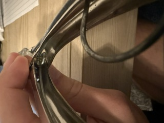
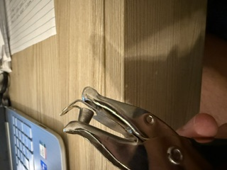
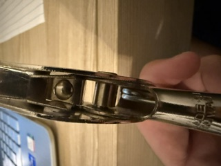

# A1 – Create portfolio

## Objective

## Analyze
While searching for engineering portfolios to analyze I came across Thanh Tran's engineering portfolio. All of his projects are very easy to find. To reproduce his work you would have to ask questions, but he does go into detail on what he has had problems with. The portfolio only tells you what he decided to do and not why he decided to do it. The language he uses is very professional and if that was a portfolio I made I would send that to an employer.

Another engineering portfolio I found was made by Nathaniel Karau. He did use GitHub to host his portfolio. You can easy find his projects also. He has a whole page on his site dedicated to his projects and his projects are well detailed. The portfolio had pictures and his cad drawings' just didn't go into why he chose to do somethings over others. This portfolio also used very professional language and I would use it to send to an employer or to get an internship. 

The Product that I chose to analyze is a Pen+Gear hole punch. The primary function of this device is to use the force from your hand as you squeeze to shove a rod through a piece of paper to provide a hole in the sheet of paper. It is a Pen+Gear hole punch. It uses a spring to come back open after you squeeze it, so spring and force equations could be used there. A shear force equation could also be used to describe what is happening when you use the puncher to punch a hole through the piece of paper.

Since the spring is inside of the handles pushing them outwards. It allows the hole punch to reopen by itself after each punch.

The head of the hole punch has a guard to help keep the paper in place, a rod on one side, and a hole on the other. All of these things hold the paper in the same place and allows it to punch out a clean hole.

This pin holds both handles and all of the components together. This pin also allows the hole punch to rotate the arms to compress and put pressure on the sheet of paper to punch a hole.

This products components was designed in 1885 as a conductors hole punch and isn't under a patent since it has been over a century. Two other devices that also achieve this are a multi hole desk top punch (Patent # 509,997 by Friedrich Soennecken) and the Japanese screw punch (by Kiichi Nonaka). The multi hole desktop punch is made with a handle that you push down to punch three holes into the paper. Why I think that they would make this chouse to put a handle that you push down would to be to make it a easy tool to use for businesses that deal with a lot of hole punching in paper. The Japanese screw punch is just a handle that you hold like a knife and poke it into the paper to create the hole. I believe they chose this idea to make it a far less complicated and simple design. 
## Decide
A visitor needs to know immediately where everything is, what the page is about, and how to navigate the page. I believe this page could use some work to make everything stand out a little more to the reader but I believe the solution to that would be to get some pictures of projects and some more detail about what I do in this class. So I haven't changed much about the homepage and hopefully will get some pictures of projects like the air engine to show the reader what the page is about. 

On the homepage I made sure everything was constant for example a paragraph would say megr 2157 and the picture would say megr 2156. I also changed the title of my portfolio to mechanical engineering portfolio instead of megr 2157 portfolio. I changed this because it seems more professional than titling it as my class that I am in. 

The quality standard that I would like to set for myself would be to do my best to begin all assignments as soon as possible and submit all assignments on time while also working toward at least a %80 on all assignments. 

## Communicate
Ty Hord
As an engineer I am a problem solver and a designer to help improve the world. Problem solving, designing and working on things with my hands is what brought me to engineering. I have begun to take an interest in robotics, aerospace, and vehicles. These things specifically have taken my interest because they can be large machines that can be complex or small machines that fulfill a small role in an operation and even if it is a small machine it can have a huge impact on the world.

What does it mean to defend an engineering decision: and do you currently know how to do it?
To defend an engineering decision is to take in the pros and cons of a decision and decide what is best for a design and be able to justify why you would make that decision rather than making another one. I believe I know how to make an engineering decision and how to defend it but not as well as a true engineer yet.

I spent about 4 hours on this assignment. 
